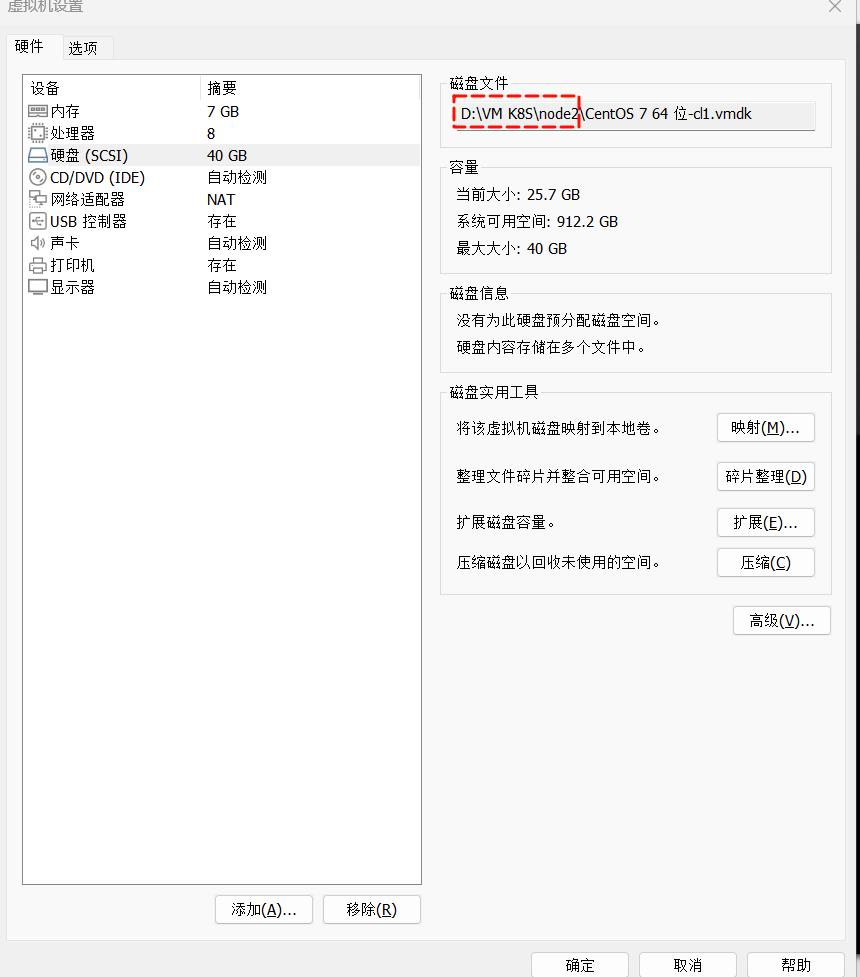
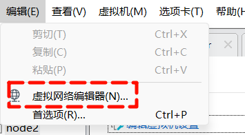
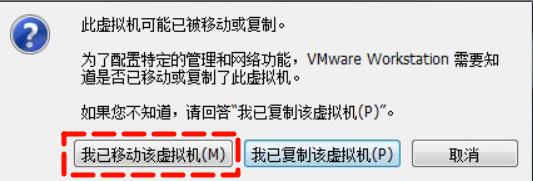

### 情景:
想将原来的K8S集群和虚拟机完整的迁移至新设备，保持IP地址 网关 网卡等网络配置不变

### 步骤
**1.打开虚拟机设置将以下目录的文件夹全部复制到新设备上**

**2.编辑虚拟网络，和原来的保持一致**

**3.打开虚拟机，选择我已移动虚拟机**

- 如果选择 `我已移动该虚拟机` 的话网卡的MAC地址会保持不变：

- 如果选择 `我已复制该虚拟机` 的话网卡的MAC地址就会变化，避免与原来的冲突

  这里我们是移动到了新设备上，所有不存在冲突问题 `直接选我已移动该虚拟机`

