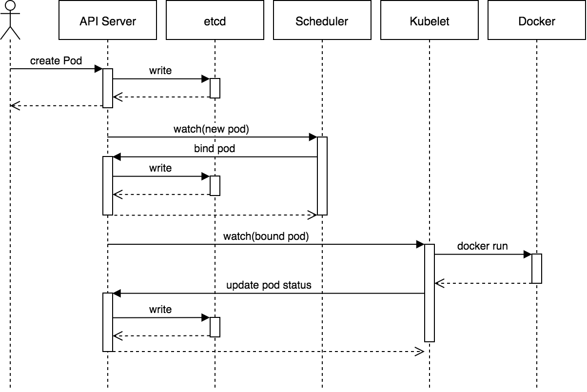

**1、用户提交创建POD请求**

**2、API Server 处理用户请求，创建一个包含pod创建信息的yaml文件，存储Pod数据到Etcd**

**3.Controller-manager 监听 Apiserver 的变化，检测到有新的 Pod 对象时，控制器创建 Pod 并将其状态设为 Pending ，然后根据配置信息将要创建的资源对象（pod）放到等待队列中**

**4、Schedule也通过监听 API Server的变化，查看到新的pod，尝试选择一个最适合的 Node 来运行新的 Pod
选择过程需要两层调度：预选调度和优选调度**

- （1）预选调度：一般根据资源对象的配置信息预先过滤掉不符合要求的Node。例如pod所需资源，NodeSelector、和节点亲和性等。

- （2）优选调度：对剩下的node根据资源对象需要的资源和node节点资源的使用情况使用算法为每个节点打分，然后选出最优的节点创建资源对象（pod）进行binding操作并将选择结果存储到Etcd中。

-  scheduler会调用API Server的API在etcd中创建一个bound pod对象，描述在一个工作节点上绑定运行的所有pod信息

**5、Pod 被调度到对应的 Node 后，该 Node 上的 kubelet 组件则开始根据 Pod 配置文件，拉镜像、启动 app、就绪探针探测 。运行在每个工作节点上的kubelet也会定期与etcd同步bound pod信息**

**6、Kubelet 向 Apiserver  上报状态为 Reday， Apiserver 将Ready状态写入到 etcd 中POD创建完成**
