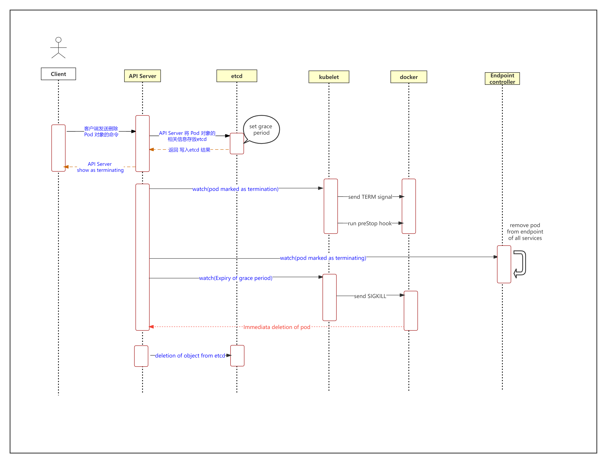

操作中，当用户提交删除请求后，系统就会进行强制删除操作的宽限期倒计时，并将 TERM 信息发送给 Pod 对象的每个容器中的主进程。宽限期倒计时结束后，这些进程将啊收到强制终止的 KILL 信号，Pod 对象随即也将由 API Server 删除。如果在等待进程终止的过程中，kubelet 或容器管理器发生了重启，那么终止操作会重新获得一个满额的删除宽限期并重新进行删除操作。·

**1）用户发送删除 Pod 对象的命令。**

**2）API server 将Pod删除信息放入etcd**

**3）API server将Pod标记为terminating并设置一个删除宽限期（一般为30s）宽限期之后pod将被强制删除**

**4）（与第 3 步同时运行）kubelet 在监控到 Pod 对象转为 "Terminating" 状态的同时启动 Pod 关闭过程。Pod 对象中的容器进程收到 TERM 信号，Pod 对象如果定义了 preStop 钩子处理器则此时会开始执行。**

- 如若宽限期结束后，preStop 仍未执行结束，则第 2 步会被重新执行并额外获取一个时长为 2 秒 的小宽限期

**5）（与第 3 步同时运行）Endpoint控制器监控到 Pod 对象的关闭行为时将其从所有匹配到此Endpoint的 Service 资源的Endpoint列表中移除。**

**6）宽限期结束后，若存在任何一个仍在运行的进程，那么 Pod 对象即会收到 SIGKILL 信号。**

**7）Kubelet 请求 API Server 将此 Pod 资源的宽限期设置为 0 从而完成删除操作，它变得对用户不再可见。**

默认情况下，所有删除操作的宽限期都是 30秒，不过， kubectl delete 命令可以使用 "--grace-period=<seconds>"选项自定义其时长，若使用 0 值则表示直接强制删除指定的资源，不过，此时需要同时为命令使用 "--force" 选项。