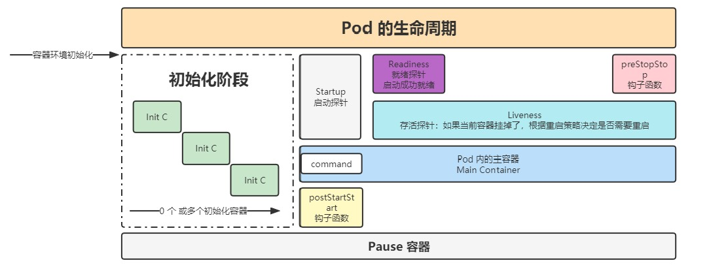
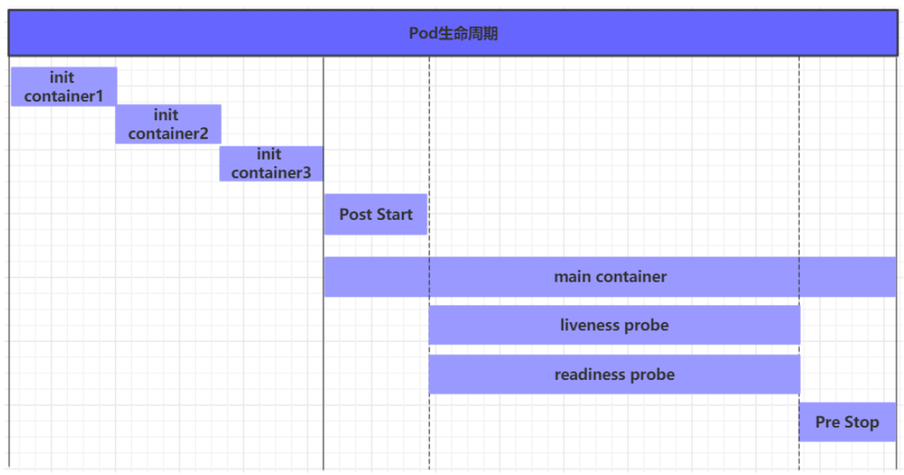

### [1.pod创建过程](Pod创建流程.md)
### **2.运行初始化容器（init container）过程**
初始化容器是在pod的主容器启动之前要运行的容器，主要是做一些主容器的前置工作
 初始化容器有很多的应用场景，下面列出的是最常见的几个：

- 提供主容器镜像中不具备的工具程序或自定义代码

- 初始化容器要先于应用容器串行启动并运行完成，因此可用于延后应用容器的启动直至其依赖的条件得到满足
  
### **3.运行主容器（main container）**
容器启动后钩子（post start）、容器终止前钩子（pre stop）
容器的存活性探测（liveness probe）、就绪性探测（readiness probe）

---

#### **钩子函数：**
钩子函数能够感知自身生命周期中的事件，并在相应的时刻到来时运行用户指定的程序代码。

kubernetes在主容器的启动之后和停止之前提供了两个钩子函数：

- **post start**：容器创建之后执行，如果失败了会重启容器

- **pre stop** ：容器终止之前执行，执行完成之后容器将成功终止，在其完成之前会阻塞删除容器的操作
  
**钩子处理器支持使用下面三种方式定义动作：**
`Exec命令`：在容器内执行一次命令
`HTTPGet`：在当前容器中向某url发起http请求
`TCPSocket`：在当前容器尝试访问指定的socket

----

#### 容器探针：
`livenessProbe 决定是否重启容器`
`readinessProbe 决定是否将请求转发给容器。`
- `liveness probes`：用于检测应用实例当前是否处于正常运行状态，一旦此类检测未通过，kubelet 将杀死容器并根据其 restartPolicy 决定是否将其重启

- `readiness probes`：用于判断容器是否准备就绪并可对外提供服务，如果不能，对于Service的endpoint列表会将其 Pod的IP移除 ，检测通过之后，会再次将其 IP 添加至Endpoint列表中

**Kubernetes 支持三种处理器用于 Pod 探测:**

`ExecAction`：在容器中执行一个命令，并根据其返回的状态码进行诊断的操作称为 Exec 探测，状态码为 0 表示成功，否则即为不健康状态。

`TCPSocketAction`：通过与容器的某 TCP 端口尝试建立连接进行诊断，端口能够成功打开即为正常，否则为不健康状态。

`HTTPGetAction`：通过向容器 IP 地址的某指定端口的指定 path 发起 HTTP GET 请求进行诊断，响应码为 2xx 或 3xx 时即为成功，否则为失败
### [4.pod终止过程](Pod的删除流程.md)

