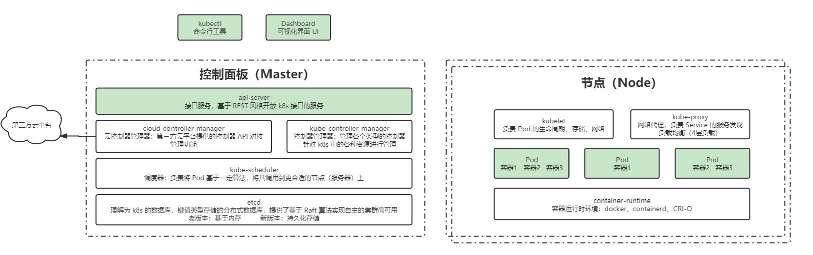
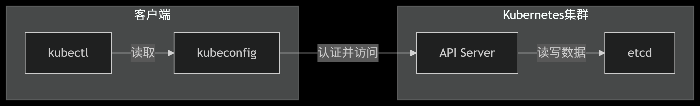

# 核心组件

K8S主要由 **master节点** 和 **node节点** 构成。
- **master节点** 负责管理集群。
- **node节点** 是容器应用真正运行的地方。

## master节点包含的组件
- **1.kube-api-server**：
api-server是k8s最重要的核心组件之一，它是k8s集群管理的统一访问入口，提供了RESTful API接口, 实现了认证、授权和准入控制等安全功能；api-server还是其他组件之间的数据交互和通信的枢纽，其他组件彼此之间并不会直接通信，其他组件对资源对象的增、删、改、查和监听操作都是交由api-server处理后，api-server再提交给etcd数据库做持久化存储，只有api-server才能直接操作etcd数据库，其他组件都不能直接操作etcd数据库，其他组件都是通过api-server间接的读取，写入数据到etcd。

- **2.kube-controller-manager**：
 controller-manager是k8s中各种控制器的的管理者，是k8s集群内部的管理控制中心，也是k8s自动化功能的核心；controller-manager内部包含replication controller、node controller、deployment controller、endpoint controller等各种资源对象的控制器，每种控制器都负责一种特定资源的控制流程，而controller-manager正是这些controller的核心管理者。

- **3，kube-scheduler**：
scheduler负责集群资源调度，其作用是将待调度的pod通过一系列复杂的调度算法计算出最合适的node节点，然后将pod绑定到目标节点上。shceduler会根据pod的信息，全部节点信息列表，过滤掉不符合要求的节点，过滤出一批候选节点，然后给候选节点打分，选分最高的就是最佳节点，scheduler就会把目标pod安置到该节点。

- **4.etcd**：
 etcd是一个分布式的键值对存储数据库，主要是用于保存k8s集群状态数据，比如，pod，service等资源对象的信息；etcd可以是单个也可以有多个，多个就是etcd数据库集群，etcd通常部署奇数个实例，在大规模集群中，etcd有5个或7个节点就足够了；另外说明一点，etcd本质上可以不与master节点部署在一起，只要master节点能通过网络连接etcd数据库即可
## node节点包含的组件
- **1.kubelet**：
每个node节点上都有一个kubelet服务进程，kubelet作为连接master和各node之间的桥梁，负责维护pod和容器的生命周期，当监听到master下发到本节点的任务时，比如创建、更新、终止pod等任务，kubelet 即通过控制docker来创建、更新、销毁容器； 每个kubelet进程都会在api-server上注册本节点自身的信息，用于定期向master汇报本节点资源的使用情况。

- **2.kube-proxy**：
 kube-proxy运行在node节点上，在Node节点上实现Pod网络代理，维护网络规则和四层负载均衡工作，kube-proxy会监听api-server中从而获取service和endpoint的变化情况，创建并维护路由规则以提供服务IP和负载均衡功能。简单理解此进程是Service的透明代理兼负载均衡器，其核心功能是将到某个Service的访问请求转发到后端的多个Pod实例上。

- **3，container-runtime**：
 容器运行时环境，即运行容器所需要的一系列程序，目前k8s支持的容器运行时有很多，如docker、rkt或其他，比较受欢迎的是docker，但是新版的k8s已经宣布弃用docker

## kubeconfig和etcd关系

kubeconfig 是客户端访问集群的“钥匙”（认证+连接配置）。

etcd 是集群的“大脑”（存储所有数据），客户端通过 API Server 间接与之交互。

### 1. kubeconfig
作用
身份认证与集群访问控制：kubeconfig 是一个配置文件（默认位于 ~/.kube/config），用于存储以下信息：

集群的 API Server 地址（如 https://<IP>:6443）。

用户认证凭据（如证书、Token、用户名密码）。

上下文（Context）定义，方便切换不同集群或命名空间。

客户端工具依赖：kubectl、helm 等工具通过 kubeconfig 文件与 Kubernetes API Server 交互。

关键特点
纯客户端配置：不存储在集群内，仅影响本地访问行为。

不涉及数据存储：只负责认证和连接，不保存集群状态。

###  2. etcd
作用
Kubernetes 的分布式数据库：etcd 是集群的唯一真实数据源，存储所有集群状态，包括：

节点信息（Nodes）、Pod 定义、Service、ConfigMap、Secret 等资源。

集群的当前状态和期望状态（由控制平面组件如 kube-controller-manager 同步）。

一致性保障：基于 Raft 协议实现高可用和数据一致性。

关键特点
服务端核心组件：运行在 Kubernetes 控制平面（Master 节点）上。

直接由 API Server 访问：kubectl 等客户端工具不直接操作 etcd，而是通过 API Server 间接读写。

