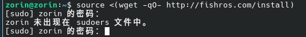

# 软件版本
`Vmware`:16
`Debain`:13.3
`K8s`:1.34

# Debian 13.3 安装

## 1.前往官方或者镜像网站下载Debian 13.3 ISO镜像
 我下载的是：debian-13.3.0-amd64-DVD-1.iso

## 2.创建虚拟机并安装Debian 13.3
由于Vmware16版本较旧无法识别Debian 13.3镜像，所以创建虚拟机时选择较低的版本Debain即可，比如Debian 10。

安装过程参考B站视频[Debian13 保姆级安装教程](https://www.bilibili.com/video/BV1YEsazoEsS/?spm_id_from=333.337.search-card.all.click&vd_source=b9c639db66d1d92699bdd73eff797082)

**我这里安装时额外选择了镜像源站点中科大站点和SSH服务，方便后续操作，换源操作也可以安装之后在操作界面实现**

## 3.安装完成后进行基础配置
### **1.禁用DVD/ISO CD-ROM软件包源**

```
当你从DVD/ISO在计算机上安装Debian时，安装程序会配置cdrom软件包源。这个软件包源不会更新，并且在更新过程中会出现错误，因为该软件包源没有要更新的发行文件。

为确保你可以安装常规更新，请通过使用root命令访问/etc/apt/sources.list文件，并注释掉以deb cdrom开头的行。

使用你喜欢的Linux文本编辑器，比如Vim、vi或nano，运行以下命令：

nano /etc/apt/sources.list
```

### **2.(没有出现此问题)授予主用户超级用户权限**
用户账户可能没有超级用户访问权限。导致在非root 账户下输入密码也无法使用 sudo 命令。

```
出于安全原因，Debian 在安装期间不允许任何选项给予用户账户 sudo 访问权限。
要授予主用户 sudo 访问权限，请执行以下步骤：
```
**方法1**：
- 输入`su`使用 root 密码进入 root 账户
- 通过运行以下命令将本地用户添加为sudo用户：
`usermod -aG sudo <用户名>`
**方法2（没有usermod）**：
- 输入`su`使用root 密码进入 root 账户
- 编辑sudoers文件
`vi /etc/sudoers`
将`%sudo   ALL=(ALL:ALL) ALL`修改为`<你的用户名>   ALL=(ALL:ALL) ALL`
- 强制保存退出 `:wq!`
### **3.更新软件包列表并升级系统**
```
sudo apt update
sudo apt upgrade

```
### **4.安装常用工具**
`sudo apt install ffmpeg default-jdk git wget nano vim htop locate p7zip p7zip-full unzip`

### 5 配置clash 和安装docker(可选，有相关文档不做赘述) 


# K8s v1.34 安装
> ⭐以下所有加速镜像源配置不管是否有全局代理都必须要依照教程配置，否则k8s组件无法安装成功

## 基础配置：
### 1.配置静态ip(参考github仓库中的Debain 13配置静态IP文档)、


### 2.修改主机名(如果三个节点主机名一样则需要修改，否则后续集群配置会冲突)
```bash
sudo hostnamectl set-hostname <your-hostname>
```
### 3.配置hosts域名解析文件(所有主机都需要配置)
```bash
vim /etc/hosts
```

```
# Kubernetes Cluster Nodes
192.168.219.128  k8s-master
192.168.219.129  k8s-node1
192.168.219.130  k8s-node2


```

### 4.关闭swap分区
```bash
# 临时关闭
sudo swapoff -a
# 永久禁用 (注释掉 fstab 文件中的 swap 行)
sudo sed -i '/ swap / s/^\(.*\)$/#\1/g' /etc/fstab
```
### 5.关闭防火墙和selinux(如果有)
```bash
systemctl stop firewalld 
systemctl disable firewalld
# 禁用 Uncomplicated Firewall（ufw）
sudo ufw disable

# 停止 ufw 服务
sudo systemctl stop ufw.service

# 禁用 ufw 服务
sudo systemctl disable ufw.service

```

### 6 内核参数配置
- overlay 是文件系统。由于Docker是分层的，上层的文件会覆盖下层的文件，使用到了overlay文件系统。
  
- br_netfilter 网络转发。br_netfilter模块可以使 iptables 规则可以在 Linux Bridges 上面工作，用于将桥接的流量转发至iptables链。如果没有加载br_netfilter模块，那么并不会影响不同node上的pod之间的通信，但是会影响同node内的pod之间通过service来通信。


```bash
cat <<EOF | sudo tee /etc/modules-load.d/k8s.conf
overlay
br_netfilter
EOF
```
​
```bash
sudo modprobe overlay
sudo modprobe br_netfilter
​
```
```bash
# 设置 sysctl 参数，使其在重启后保持生效
cat <<EOF | sudo tee /etc/sysctl.d/k8s.conf
net.bridge.bridge-nf-call-iptables  = 1
net.bridge.bridge-nf-call-ip6tables = 1
net.ipv4.ip_forward                 = 1
EOF
```
​
```bash
# 应用 sysctl 参数
sudo sysctl --system

```

### 7 配置时间同步
使用 chrony 同步时间
```bash
# 安装chrony
sudo apt install -y chrony

sudo systemctl enable --now chrony

# 查看时间
date

```

## 安装容器运行时
这里可以选择两者容器运行时：
- Docker(安装cri-dockerd)
- containerd

### 1.这里我选择containerd安装
```bash
#安装
sudo apt-get update
sudo apt-get install -y containerd.io
# 生成默认配置文件
sudo mkdir -p /etc/containerd
sudo containerd config default | sudo tee /etc/containerd/config.toml
```
### 2.修改文件下内容

```bash
#编辑配置
sudo vim /etc/containerd/config.toml
```
```yaml
SystemdCgroup = true   # false改为true

sandbox_image = "registry.aliyuncs.com/google_containers/pause:3.10" # 修改Pause 镜像源为阿里云镜像，后续kubeadm init时会从该源拉取沙箱镜像
```
### 3.使配置生效
```bash
sudo systemctl restart containerd
sudo systemctl enable containerd
```

### 4.为crictl创建一个配置文件
**为容器运行时命令行工具crictl创建一个配置文件，让它知道如何与containerd运行时通信**
```bash
cat <<EOF | sudo tee /etc/crictl.yaml
runtime-endpoint: unix:///run/containerd/containerd.sock
image-endpoint: unix:///run/containerd/containerd.sock
timeout: 10
debug: false
EOF
```
## 重启所有主机使应用以上某些未生效配置
```bash
sudo reboot
```
## 安装K8S三大组件 kubeadm、kubelet、 和 kubectl
`kubeadm`：用于快速初始化和管理 Kubernetes 集群的引导和部署工具，例如执行 kubeadm init 创建控制平面。

`kubelet`：运行在每个节点上的“节点代理”，负责管理本节点上 Pod 的生命周期，是 Kubernetes 集群的工作引擎。

`kubectl`：用户通过命令行与 Kubernetes 集群交互的核心客户端工具，用于部署应用、管理集群资源。

### 1.安装使用 Kubernetes apt 仓库所需要的包
```bash
sudo apt-get update

# 如果 apt-transport-https 不存在，可以跳过它
sudo apt-get install -y apt-transport-https ca-certificates curl gpg

```
### 2.下载用于 Kubernetes 软件包仓库的公共签名密钥。所有仓库都使用相同的签名密钥，因此你可以忽略URL中的版本：
```bash
# 如果 /etc/apt/keyrings 这个路径不存在，请先使用以下被注释的命令创造一下
# sudo mkdir -p -m 755 /etc/apt/keyrings
curl -fsSL https://pkgs.k8s.io/core:/stable:/v1.34/deb/Release.key | sudo gpg --dearmor -o /etc/apt/keyrings/kubernetes-apt-keyring.gpg

```

### 3.添加 Kubernetes apt 仓库
请注意，此仓库仅包含适用于 Kubernetes 1.34 的软件包； 对于其他 Kubernetes 次要版本，则需要更改 URL 中的 Kubernetes 次要版本以匹配你所需的次要版本 （你还应该检查正在阅读的安装文档是否为你计划安装的 Kubernetes 版本的文档）。
```bash
# 注意，该命令将覆盖已经存在的 /etc/apt/sources.list.d/kubernetes.list 文件内的内容
echo 'deb [signed-by=/etc/apt/keyrings/kubernetes-apt-keyring.gpg] https://pkgs.k8s.io/core:/stable:/v1.34/deb/ /' | sudo tee /etc/apt/sources.list.d/kubernetes.list

```
### 4.安装 kubelet、kubeadm 和 kubectl，并锁定其版本
```bash
sudo apt-get update
sudo apt-get install -y kubelet kubeadm kubectl
sudo apt-mark hold kubelet kubeadm kubectl

```
**先启用 kubelet 服务，再运行 kubeadm： 这个就不配置kubelet的cgroup了，因为默认systemd**
```bash
sudo systemctl enable --now kubelet
```

## 搭建一主两从集群
### 1.所有节点
⭐**如果没有losetup则需要先安装**
```bash
# 查看是否安装
losetup -a
# 安装 
sudo apt-get update && sudo apt-get install -y util-linux
```
如果还是没有则可能是目录当前不在你的系统 PATH 环境变量中，我们需要找到目录位置然后建立软连接即可
```bash
 find / -name losetup -type f 2>/dev/null

```
```
输出结果
/usr/share/bash-completion/completions/losetup

/usr/lib/klibc/bin/losetup

/usr/sbin/losetup

```
```bash
# 将 /usr/sbin/losetup 连接到 /usr/bin/losetup
sudo ln -s /usr/sbin/losetup /usr/bin/losetup

# 再次验证，这次应该能打印出路径了
which losetup
```
⭐**如果安装了clash全局代理，在当前shell中临时取消代理**：
```bash
unset http_proxy https_proxy HTTP_PROXY HTTPS_PROXY
```
### 2.Master节点上执行初始化


**kubeadm初始化**
```bash
kubeadm init \
--kubernetes-version=v1.34.1 \
--control-plane-endpoint=192.168.219.128 \
--apiserver-advertise-address=192.168.219.128 \
--pod-network-cidr=192.168.0.0/16 \
--service-cidr=10.96.0.0/12 \
--image-repository=registry.aliyuncs.com/google_containers \

```
**如何初始化失败，解决某些问题后可以执行 `kubeadm reset -f` 重置后再次尝试安装**
#### 参数解释
`--control-plane-endpoint`：**可以设置为master主机ip地址**，指定控制平面的访问地址，可以是IP地址或域名。

`--pod-network-cidr`：指定 Pod 网络的 IP 地址段。这个值必须与你后面将要安装的网络插件匹配,**Flannel设为10.244.0.0/16,Calico设为192.168.219.128/16。**

`--apiserver-advertise-address`：**设为master的主机ip地址**，API 服务器对外通告的 IP 地址，其他节点将通过这个 IP 连接到控制平面。

`--service-cidr`：指定服务网络的 IP 地址段，Kubernetes 集群内的服务将使用这个地址段分配 IP 地址。

`--image-repository`= 指定拉取 Kubernetes 核心镜像的仓库地址为阿里云镜像，加速拉取速度。

#### 之后输出信息中会生成两个关键命令，依照输出为准：
```bash
To start using your cluster, you need to run the following as a regular user:

mkdir -p $HOME/.kube
sudo cp -i /etc/kubernetes/admin.conf $HOME/.kube/config
sudo chown $(id -u):$(id -g) $HOME/.kube/config

Then you can join any number of worker nodes by running the following on each as root:

kubeadm join 192.168.219.128:6443 --token ygfm3y.j09l6zt9am7r12km \
        --discovery-token-ca-cert-hash sha256:1f2b3ab32d38c3308677275da1df6066e6a518e27df83824b2b9a470c0ee2d7e
```

**1.配置 kubectl 权限命令**：
```bash
mkdir -p $HOME/.kube
sudo cp -i /etc/kubernetes/admin.conf $HOME/.kube/config
sudo chown $(id -u):$(id -g) $HOME/.kube/config

```
**2.使其他节点加入集群**
```bash
kubeadm join 192.168.219.128:6443 --token ygfm3y.j09l6zt9am7r12km \
        --discovery-token-ca-cert-hash sha256:1f2b3ab32d38c3308677275da1df6066e6a518e27df83824b2b9a470c0ee2d7e
```
### 3.Master节点给上执行
**为了让你当前的用户能使用 kubectl 命令管理集群，我们需要把管理员的 kubeconfig 文件复制到当前用户的主目录下**：
```bash
mkdir -p $HOME/.kube
sudo cp -i /etc/kubernetes/admin.conf $HOME/.kube/config
sudo chown $(id -u):$(id -g) $HOME/.kube/config
```
### 4.Woker节点给上执行
**执行上面master节点输出的加入集群命令即可**
```bash
kubeadm join 192.168.219.128:6443 --token ygfm3y.j09l6zt9am7r12km \
        --discovery-token-ca-cert-hash sha256:1f2b3ab32d38c3308677275da1df6066e6a518e27df83824b2b9a470c0ee2d7e
```


### 5.Master节点执行，安装网络插件calico
**原则上面是要在每一个集群上面都进行calico的安装，但是在master上面执行就可以，因为kubectl会自动在每个节点上面安装calico-node节点**

#### 为了使得calico镜像以及后续其它镜像能够顺利拉取，这里我为容器运行时containerd 设置代理
```bash
# 创建 containerd 代理配置
sudo mkdir -p /etc/systemd/system/containerd.service.d 
# 创建一个 http-proxy.conf 文件
sudo vim /etc/systemd/system/containerd.service.d/
```
####  http-proxy.conf 添加以下内容
```yaml
[Service]
Environment="HTTP_PROXY=http://127.0.0.1:7890"
Environment="HTTPS_PROXY=http://127.0.0.1:7890"
Environment="NO_PROXY=localhost,127.0.0.1"
```
####  修正
- 如果是以上配置，Containerd 就会傻乎乎地把这些内部流量全部发给你的 Clash 代理（127.0.0.1:7890）。Clash 根本无法处理这些内部 IP，会导致连接全部超时或拒绝。
- 为了让 Containerd 拉取外部镜像（走代理），又不影响集群内部通信（直连）。我们需要根据之前 kubeadm init的参数实际修正为以下内容：
```bash
[Service]
Environment="HTTP_PROXY=http://127.0.0.1:7890"
Environment="HTTPS_PROXY=http://127.0.0.1:7890"
# ⚠️ 关键修改：加入了你的物理网段、Service网段、Pod网段和集群后缀
Environment="NO_PROXY=localhost,127.0.0.1,192.168.219.0/24,10.96.0.0/12,192.168.0.0/16,.svc,.cluster.local"
```

```bash
# 重新加载配置并重启 containerd
sudo systemctl daemon-reload 
sudo systemctl restart containerd
```
#### calico安装应用
```bash
# 1下载地址
wget https://docs.projectcalico.org/manifests/calico.yaml

# 2修改配置
## 因为在第 1 步中使用的就是 192.168.0.0/16，calico默认就是对的，这里不用修改。
# 如果你用了别的网段，比如 10.244.0.0/16，那么必须修改。

# 3 应用配置和测试
kubectl apply -f calico.yaml
kubectl get pods -n kube-system ## 检查所有pod是running状态
kubectl get node ## 检查所有node是Ready状态
```
## 6. 全部部署配置完成！

**`kubectl get node`你会看到类似如下输出，恭喜你你成功了！！！！**：
```yaml
NAME         STATUS   ROLES           AGE   VERSION

k8s-master   Ready    control-plane   27m   v1.34.3

k8s-node1    Ready    <none>          23m   v1.34.3

k8s-node2    Ready    <none>          23m   v1.34.3
```